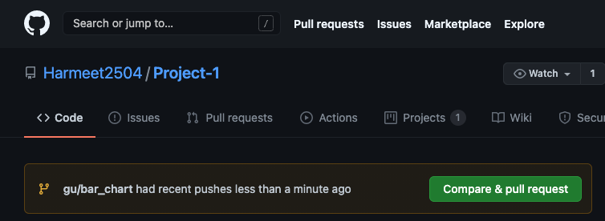
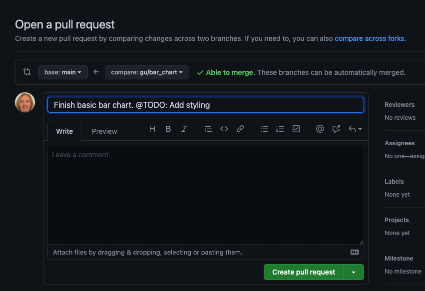
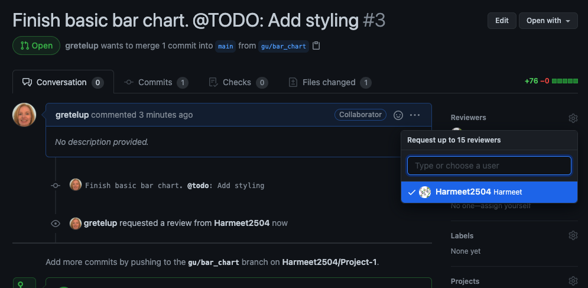
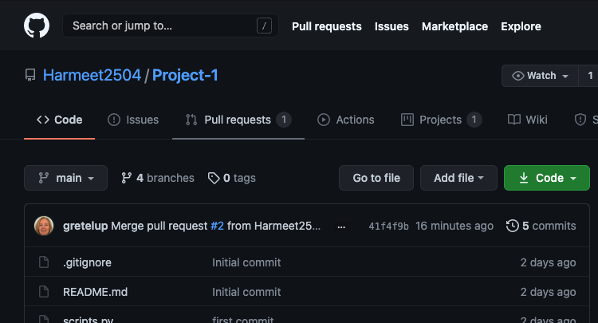
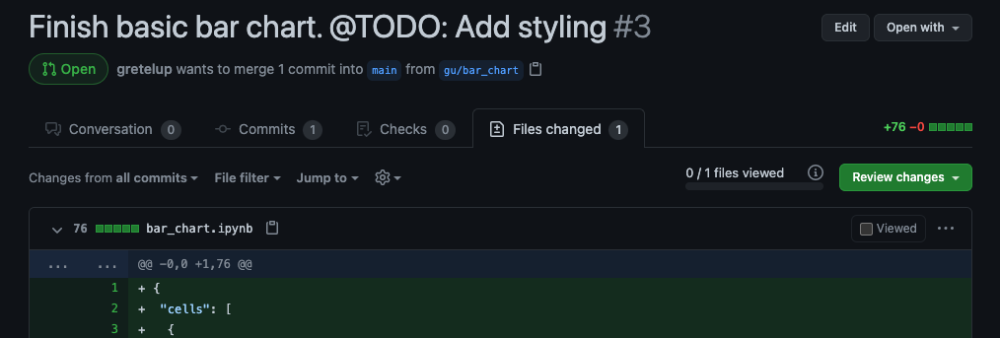
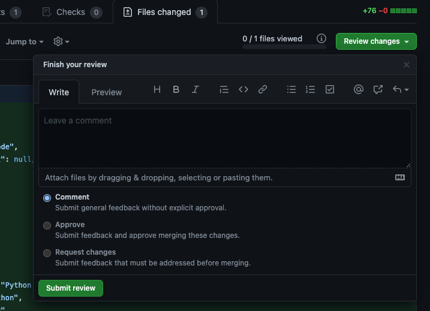
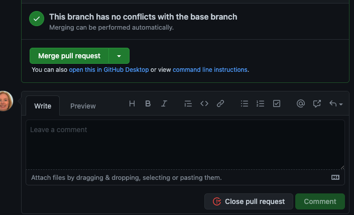
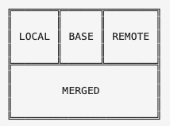

# Git Workflow for Projects

- - -

## Basic Rules

1. **NEVER WORK ON THE SAME FILE IN TWO SEPARATE BRANCHES.**
2. Never work directly on the `main` branch.
3. Whenever someone updates the `main` branch, `pull` those changes to all feature branches.
4. **NEVER WORK ON THE SAME FILE IN TWO SEPARATE BRANCHES.**
5. Always `pull` changes from `main` before pushing changes from reature branch.
6. Always have someone review changes in a feature branch before merging to main.
7. Add specific files to your commit instead of using the `git add .` or `git add -A` commands.
8. **NEVER WORK ON THE SAME FILE IN TWO SEPARATE BRANCHES.**
9. Do not slack changes to team members so they can update the repository.
10. **Write *meaningful* commit messages.**
11. Do not make changes on GitHub. Make changes locally on your computer, then push and merge those changes on GitHub.
12. **NEVER WORK ON THE SAME FILE IN TWO SEPARATE BRANCHES.**

## Basic Workflow Commands

When working locally (i.e., on your computer), you will be using git in the command line. When working remotely, you will be using github on a web browser.

### Working Locally

* Create and move to new feature branch:  `git checkout -b <branch name>`

  * Feature branches should be limited in scope and do one specific thing. The name of that branch should reflect that specific thing, NOT YOUR NAME. Best practice is to include your initials/feature
  * Example: `git checkout -b gu/bar_chart`

* Move to a branch that has already been created: `git checkout main`
* Add changes to your branch to be committed: `git add <file changed>`
  * Do NOT use `git add .` or `git add -A`. You may accidentally track files you do not intend to track, causing merge conflicts.
  * Example: `git add bar_chart.ipynb`
* Commit changes: `git commit -m "<commit message>"`
  * Write MEANINGFUL commit messages. "Second commit", "Changes to notebook", and "Update README" are **NOT MEANINGFUL**
  * You want a commit to be a checkpoint. You want to convey the information both to your team and yourself the status of your code at this time. 
  * You should always commit when you have your code in a good working state. If there is additional work to be done, indicate that as well. 
  * Be specific.
  * If your commit message needs to be more than 72 characters, do not use the `-m` flag. Just use `git commit` and write a multi-line message in your default editor (most likely VIM). For help using VIM, there are many resources available through googling.
  * Example: `git commit -m "Finish basic bar chart. @TODO: Add styling"`
* Pull changes from `main` branch to working feature branch: `git pull origin main`
* The first time you want to push changes, you first need to set a remote branch to mirror your local branch: `git push --set-upstream origin <branch name>`
* Push changes from local feature branch to remote feature branch: `git push origin <branch name>`
* If you have changes on your local feature branch that you DO NOT want to keep, AFTER committing the changes you DO want to keep, stash those changes: `git stash`

### Working Remotely

* After you have pushed the changes from your local feature branch to your remote feature branch, go to your github repository on your browser.
* There you will see a message about your branch pushing changes, along with a big green "Compare & pull request" button. Click on that button.

* This will bring you to the "Open a pull request page." If there are no problems, you will see a comparison to the main branch with a green check mark indicating "Able to merge." Click the big green button at the bottom of the screen that says "Create pull request"

* On the next page, you should see another green check mark saying "This branch has no conflicts with the base branch." If you have branch protection rules in place, you must now select a reviewer. You can do this by clicking the gear next to "Reviewers" on the right side and select a collaborator to review your pull request.

* On of your collaborators must go to the project GitHub, and click on the "Pull requests" option at the top of the screen (there should be a 1 next to it).
* 
* After clicking on that pull request, they will be brought to that last screen, where they can review the commits and the files changed.


* The Reviewer can then click on the "Review changes" button. Select either "Approve" or "Request changes" and click the Submit review button.

* If approved, the reviewer can then select "Merge pull request" on the Conversation tab. Then click on "Confirm merge."


## Merge Conflicts

If you have followed all the directions in this document, you will not have merge conflicts. If you do, it can be A LOT of work to resolve them. It is much easier to do locally than remotely, which is why it is important to do a `git pull origin main` before doing a `git push`.

### Resolving Merge Conflicts Locally Using the Command Line.

There are various ways to resolve conflicts that you can research on google. This is the way I have found to be the most straightforward. Make sure you are on the branch with the conflicts, then run the following lines of code: 

```git config merge.tool vimdiff
git config merge.conflictstyle diff3
git config mergetool.prompt false
git mergetool
```

Your display will now look like this: 



* LOCAL - What the file looks like on your current local branch
* BASE - What the file looked like before both local and remote changes.
* REMOTE - What the file looks like on your remote branch.
* MERGED - The current merge result.

You can choose to keep only your local changes (getting rid of your remote changes), your remote changes (getting rid of your local cahnges), or revert back to base (getting rid of both remote and local changes). You do that through the following commands (note the colon; it is necessary):

* Keep LOCAL: `:diffg LO`
* Keep REMOTE: `:diffg RE`
* Keep BASE: `:diffg BA`

You can also choose to edit MERGED to get some sort of combination of those changes. To do this, you would type use the following commands: **ctrl + w** followed by **j** and then edit the MERGED file. This can be intimidating to people not used to using command line editors.

After you have selected what changes to keep, enter `:wqa` to save and exit from vi.

Then, commit your change with a message, e.g., `git commit -m "Fix merge conflict; kept local changes"`

Then push: `git push`

Then clean up any junk files created by tool (It is ok if you get an error message here): `git clean`
